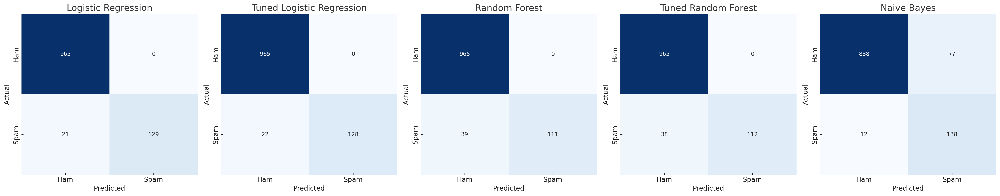

## **Project Description**

> An interactive **Spam Email Classifier** built with **Logistic Regression**, **Bag of Words**, and **Streamlit**. Classifies emails as **SPAM** or **HAM** with confidence scores and explains predictions by highlighting influential words. Features a custom-styled UI with background image support.

---

## ✨ Features

- 📤 **Upload** or paste your email text  
- 🧐 Classifies as **SPAM** or **HAM** with **confidence %**  
- 🔍 Highlights **top words** influencing the classification  
- 🎨 Beautiful UI with **custom background** styling (base64-encoded image)  
- ⚡ Fast and lightweight — runs locally or on cloud  

---

## 🛠 Tech Stack

- **Python** 🐍  
- **Scikit-learn** — Logistic Regression  
- **Streamlit** — Web UI  
- **Joblib** — Model storage  
- **Base64** — Background styling  

---

## 📊 Dataset & Challenge

- **Class 0 (HAM)** — 965 samples  
- **Class 1 (SPAM)** — 150 samples  
- **Imbalanced dataset** → Recall and **F1-score for SPAM** are most critical.

**Best Model: Logistic Regression**  
✅ All predicted spam are actual spam — **0 false positives**  
✅ Misses only 14% of spam  
✅ **F1-score**: `0.92` (highest among tested models)

---

## 🚫 Why Not Random Forest?
- 0 false positives, but **misses 39 spam emails** → Low recall for spam.

## 🚫 Why Not Naive Bayes?
- High recall (only 12 spam missed)  
- ❌ But **77 legitimate emails** wrongly flagged as spam.

---

## 🚀 Installation & Usage

### 1️⃣ Clone the repository
```bash
git clone https://github.com/afshalliaquat/Spam-Email-Classifier.git
cd Spam-Email-Classifier
````

### 2️⃣ Install dependencies

```bash
pip install -r requirements.txt
```

### 3️⃣ Run the Streamlit app

```bash
streamlit run app.py
```

---

## 🎯 How It Works

1. Input or upload an email text.
2. Text is vectorized using **Bag of Words**.
3. **Logistic Regression** predicts SPAM or HAM.
4. Top influencing words are highlighted.


